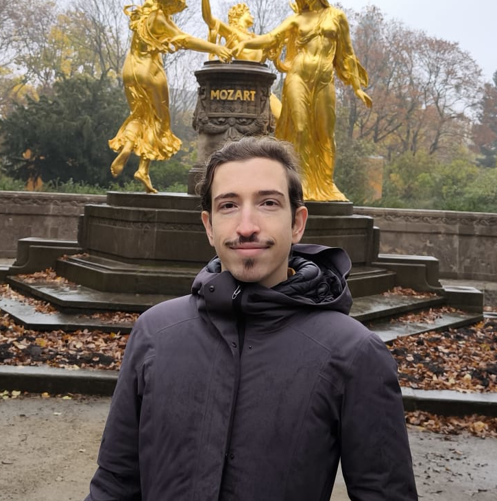
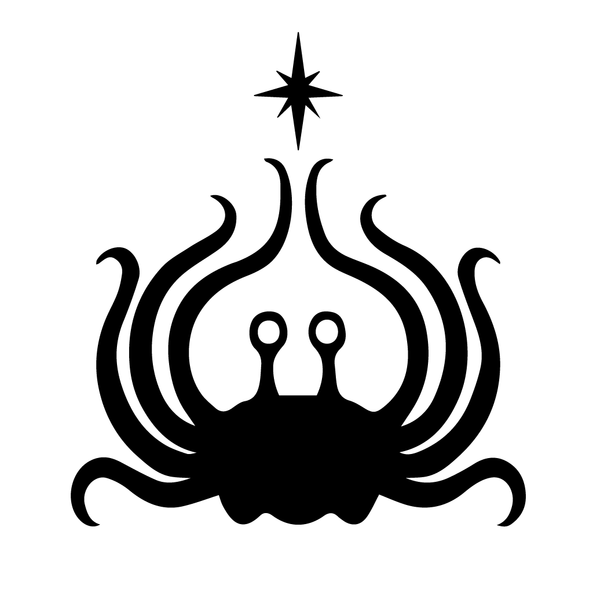

  
  

    <h1 class="title">Hola, aquí Gonzalo!</h1>
    

  <a href="https://scholar.google.com/citations?user=hfQKzTYAAAAJ&hl=en" target="_blank" rel="noopener" style="display:inline-flex;align-items:center;gap:0.5rem;text-decoration:none;color:var(--color-accent-2);">
    <svg viewBox="0 0 24 24" role="img" aria-hidden="true" style="width:20px;height:20px;opacity:0.9;" xmlns="http://www.w3.org/2000/svg" fill="currentColor">
      <path d="M12 24a7 7 0 1 1 0-14 7 7 0 0 1 0 14zm0-24L0 9.5l4.838 3.94A8 8 0 0 1 12 9a8 8 0 0 1 7.162 4.44L24 9.5z"/>
    </svg>
    Google Scholar
  </a>
  <a href="https://github.com/goznalo-git" target="_blank" rel="noopener" style="display:inline-flex;align-items:center;gap:0.5rem;text-decoration:none;color:var(--color-accent-2);">
    <svg stroke="currentColor" fill="currentColor" stroke-width="0" viewBox="0 0 24 24" aria-hidden="true" style="width:20px;height:20px;opacity:0.9;" xmlns="http://www.w3.org/2000/svg"><path fill-rule="evenodd" clip-rule="evenodd" d="M12.026 2c-5.509 0-9.974 4.465-9.974 9.974 0 4.406 2.857 8.145 6.821 9.465.499.09.679-.217.679-.481 0-.237-.008-.865-.011-1.696-2.775.602-3.361-1.338-3.361-1.338-.452-1.152-1.107-1.459-1.107-1.459-.905-.619.069-.605.069-.605 1.002.07 1.527 1.028 1.527 1.028.89 1.524 2.336 1.084 2.902.829.091-.645.351-1.085.635-1.334-2.214-.251-4.542-1.107-4.542-4.93 0-1.087.389-1.979 1.024-2.675-.101-.253-.446-1.268.099-2.64 0 0 .837-.269 2.742 1.021a9.582 9.582 0 0 1 2.496-.336 9.554 9.554 0 0 1 2.496.336c1.906-1.291 2.742-1.021 2.742-1.021.545 1.372.203 2.387.099 2.64.64.696 1.024 1.587 1.024 2.675 0 3.833-2.33 4.675-4.552 4.922.355.308.675.916.675 1.846 0 1.334-.012 2.41-.012 2.737 0 .267.178.577.687.479C19.146 20.115 22 16.379 22 11.974 22 6.465 17.535 2 12.026 2z"></path></svg>
    GitHub
  </a>
  <!-- <a href="https://medium.com/--------" target="_blank" rel="noopener" style="display:inline-flex;align-items:center;gap:0.5rem;text-decoration:none;color:var(--color-accent-2);">
    <svg stroke="currentColor" fill="currentColor" stroke-width="0" viewBox="0 0 24 24" aria-hidden="true" style="width:20px;height:20px;opacity:0.9;" xmlns="http://www.w3.org/2000/svg"><path d="M4.285 7.269a.733.733 0 0 0-.24-.619l-1.77-2.133v-.32h5.498l4.25 9.32 3.736-9.32H21v.319l-1.515 1.451a.45.45 0 0 0-.168.425v10.666a.448.448 0 0 0 .168.425l1.479 1.451v.319h-7.436v-.319l1.529-1.487c.152-.15.152-.195.152-.424V8.401L10.95 19.218h-.575L5.417 8.401v7.249c-.041.305.06.612.275.833L7.684 18.9v.319H2.036V18.9l1.992-2.417a.971.971 0 0 0 .257-.833V7.269z"></path></svg>
    Medium
  </a> -->
  <a href="https://www.linkedin.com/in/gonzalo-contr/" target="_blank" rel="noopener" style="display:inline-flex;align-items:center;gap:0.5rem;text-decoration:none;color:var(--color-accent-2);">
    <svg stroke="currentColor" fill="currentColor" stroke-width="0" viewBox="0 0 24 24" aria-hidden="true" style="width:20px;height:20px;opacity:0.9;" xmlns="http://www.w3.org/2000/svg"><path d="M20 3H4a1 1 0 0 0-1 1v16a1 1 0 0 0 1 1h16a1 1 0 0 0 1-1V4a1 1 0 0 0-1-1zM8.339 18.337H5.667v-8.59h2.672v8.59zM7.003 8.574a1.548 1.548 0 1 1 0-3.096 1.548 1.548 0 0 1 0 3.096zm11.335 9.763h-2.669V14.16c0-.996-.018-2.277-1.388-2.277-1.39 0-1.601 1.086-1.601 2.207v4.248h-2.667v-8.59h2.56v1.174h.037c.355-.675 1.227-1.387 2.524-1.387 2.704 0 3.203 1.778 3.203 4.092v4.71z"></path></svg>
    LinkedIn
  </a>
  <!-- <a href="https://x.com/--------" target="_blank" rel="noopener" style="display:inline-flex;align-items:center;gap:0.5rem;text-decoration:none;color:var(--color-accent-2);">
    <svg xmlns="http://www.w3.org/2000/svg" fill="currentColor" class="bi bi-twitter-x" viewBox="0 0 16 16" id="Twitter-X--Streamline-Bootstrap" style="width:20px;height:20px;opacity:0.9;"><path d="M12.6 0.75h2.454l-5.36 6.142L16 15.25h-4.937l-3.867 -5.07 -4.425 5.07H0.316l5.733 -6.57L0 0.75h5.063l3.495 4.633L12.601 0.75Zm-0.86 13.028h1.36L4.323 2.145H2.865z" stroke-width="1"></path></svg>
  Twitter
  </a> -->
   <a href="https://orcid.org/0000-0002-8118-6403" target="_blank" rel="noopener" style="display:inline-flex;align-items:center;gap:0.5rem;text-decoration:none;color:var(--color-accent-2);">
    <svg xmlns="http://www.w3.org/2000/svg" fill="currentColor" viewBox="0 0 32 32" style="width:20px;height:20px;opacity:0.9;"><path d="M16 0c-8.839 0-16 7.161-16 16s7.161 16 16 16c8.839 0 16-7.161 16-16s-7.161-16-16-16zM9.823 5.839c0.704 0 1.265 0.573 1.265 1.26 0 0.688-0.561 1.265-1.265 1.265-0.692-0.004-1.26-0.567-1.26-1.265 0-0.697 0.563-1.26 1.26-1.26zM8.864 9.885h1.923v13.391h-1.923zM13.615 9.885h5.197c4.948 0 7.125 3.541 7.125 6.703 0 3.439-2.687 6.699-7.099 6.699h-5.224zM15.536 11.625v9.927h3.063c4.365 0 5.365-3.312 5.365-4.964 0-2.687-1.713-4.963-5.464-4.963z"/></svg>
  ORCID
  </a> 
  
    <svg xmlns="http://www.w3.org/2000/svg" width="16" height="16" fill="currentColor" class="bi bi-envelope" viewBox="0 0 16 16" style="width:20px;height:20px;opacity:0.9;"> <path d="M0 4a2 2 0 0 1 2-2h12a2 2 0 0 1 2 2v8a2 2 0 0 1-2 2H2a2 2 0 0 1-2-2zm2-1a1 1 0 0 0-1 1v.217l7 4.2 7-4.2V4a1 1 0 0 0-1-1zm13 2.383-4.708 2.825L15 11.105zm-.034 6.876-5.64-3.471L8 9.583l-1.326-.795-5.64 3.47A1 1 0 0 0 2 13h12a1 1 0 0 0 .966-.741M1 11.105l4.708-2.897L1 5.383z" stroke="currentColor" stroke-width="0.5"/></svg>
  gcontrer (at) math (dot) uc3m (dot) es
  
    

  

I am a theoretical physicists / applied mathematician (more the former than the latter), working in areas such as complex networks and nonlinear dynamics. My scientific interests, however, are much wider than that, spanning pure mathematics to computer science. My nonscientific interests are quite varied; I play the guitar and I am passionate about all sorts of music (alternative rock, jazz, electronic music, hip-hop, metal, funk...). I also frequently go to the cinema, and at some point in the past I had a podcast. 

Nevertheless, this is a "professional" website, hence here's a non-exclusive list of scientific topics I am working or have worked on, should you want to contact me about any:
- **Nonlinear dynamics, bifurcation theory**. Lately I have been working on models of [pattern formation](https://www.youtube.com/watch?v=icQ_BTtNGEo) and dislocation dynamics, as well as the interaction of topological vortices. I also have some unpublished work on the timbrical properties of bird syllables, understood through the lens of bifurcations in dynamical systems. 
- **Complex networks, dynamical aspects**. I had the opportunity to participate in a series of projects on the synchronization of chaotic oscillators in networks, and those works triggered my interest in the subject of [synchronization](https://www.youtube.com/watch?v=T58lGKREubo), and the broader topic of networked dynamical systems. Currently, I am involved in a couple of projects related to the dynamics of excitable systems under synaptic coupling, and the relation between phase oscillators and surface growth models.  
- **Complex networks, structural aspects**. Most of my doctoral research was about spectral centrality measures in graphs, and I quite like the fact that relatively simple mathematics (e.g., linear algebra) allow for a quantitative characterization of a variety of network properties. I have also worked on hypergraphs, although I have been losing interest in them for a while (and apparently [I am not alone in that regard](https://arxiv.org/abs/2602.16937)).
- **Theoretical and mathematical physics**, in general. No surprise, given that my master's was in high energy physics stuff (black holes, strings, cosmology, AdS/CFT). While I haven't worked on that for years, I still find it fascinating.  

It's been a while, but I also used to code stuff for fun in my free time. I programmed things such as a [markovian guitar tablature generator](https://github.com/goznalo-git/MarkovPlaysTheGuitar), or an [visualizer of audiowaves/spectrograms](https://github.com/goznalo-git/AudioWaves) since I didn't like the ones I found (although I never got to finish it). 

Ah, and I also like outreach, quite a lot. Actually I will be releasing something in this direction, hopefully soon.

Long live the FSM. 

<!--While from an outsider point of view it might seem like my path was straight, it surely was full of missteps and turning points. I fell in love with theoretical, very mathematical physics (high energy stuff, strings, black holes and the like), pursuing it to the point of frustration. I left academia for a while, which allowed me to have fun again with things I had abandoned, such as programming. Nevertheless, there as always a "scientific itch" which I wanted to scratch, and when given the opportunity to pursue a Ph.D. I took it. It was in an appealing topic (mathematics of complex networks, spectral centrality measures in particular), though completely foreign to me. During this phase of my life I met several physicists who inspired me to bring physics into my research, to the point that I am currently mostly interested in dynamics (synchronization, bifurcation theory, chaos).-->

